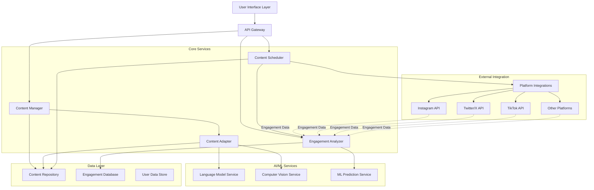

# Design Document: FlowChart Social Media Content Scheduler

## Overview

FlowChart is an intelligent social media content management system that automates content adaptation, scheduling, and optimization across multiple platforms. The system architecture follows a modular design with clear separation between content processing, scheduling, analytics, and platform integration layers.

The system leverages AI/ML capabilities for content transformation, engagement prediction, and optimization. It provides a comprehensive workflow from content ingestion through publication and performance analysis, enabling content creators to maximize reach while minimizing manual effort.

Key design principles:
- **Modularity**: Clear separation of concerns between content processing, scheduling, and analytics
- **Extensibility**: Plugin architecture for adding new platforms and AI models
- **Scalability**: Asynchronous processing and queue-based architecture for handling high content volumes
- **Reliability**: Retry mechanisms, error handling, and transaction management for robust operation

## Architecture

### System Components



### Component Responsibilities

**User Interface Layer**
- Dashboard for content management and analytics visualization
- Content upload and review interfaces
- Campaign management tools
- Analytics and reporting views

**API Gateway**
- Request routing and authentication
- Rate limiting and request validation
- Response formatting and error handling

**Content Manager**
- Content ingestion and validation
- Content lifecycle management
- Metadata management and tagging

**Content Adapter**
- Platform-specific content transformation
- AI-powered text summarization and reformatting
- Visual content optimization and resizing
- Mood detection and adaptation

**Content Scheduler**
- Publication timing optimization
- Queue management for scheduled content
- Platform API orchestration
- Retry logic and failure handling

**Engagement Analyzer**
- Engagement data collection and aggregation
- Performance prediction and trend analysis
- Audience preference learning
- Recommendation generation

**AI/ML Services**
- Language Model Service: Text transformation, summarization, tone adaptation
- Computer Vision Service: Image analysis, cropping, quality optimization
- ML Prediction Service: Engagement prediction, optimal timing calculation

**Data Layer**
- Content Repository: Source content and generated variants storage
- Engagement Database: Historical engagement metrics and analytics
- User Data Store: User preferences, credentials, and configuration

**Platform Integrations**
- Abstraction layer for social media platform APIs
- Authentication and credential management
- API-specific request formatting and response parsing

## Components and Interfaces

### Content Manager

**Purpose**: Orchestrates content ingestion, storage, and lifecycle management.

**Interface**:
```typescript
interface ContentManager {
  // Upload and store new content
  uploadContent(
    userId: string,
    content: ContentBlob,
    metadata: ContentMetadata
  ): Promise<ContentId>
  
  // Retrieve content by ID
  getContent(contentId: ContentId): Promise<StoredContent>
  
  // List user's content with filtering
  listContent(
    userId: string,
    filters: ContentFilters
  ): Promise<StoredContent[]>
  
  // Delete content and all variants
  deleteContent(contentId: ContentId): Promise<void>
  
  // Update content metadata
  updateMetadata(
    contentId: ContentId,
    metadata: Partial<ContentMetadata>
  ): Promise<void>
}

interface ContentMetadata {
  title: string
  contentType: ContentType  // text, image, video, audio
  sourceFormat: string       // markdown, html, jpeg, mp4, etc.
  tags: string[]
  uploadTimestamp: Date
  userId: string
}

type ContentType = 'text' | 'image' | 'video' | 'audio'
type ContentId = string
```

**Behavior**:
- Validates content format and size on upload
- Generates unique identifiers for content tracking
- Stores original content without modification
- Maintains content-variant relationships

### Content Adapter

**Purpose**: Transforms content between formats and optimizes for platform-specific requirements.

**Interface**:
```typescript
interface ContentAdapter {
  // Generate platform-specific variants from source content
  adaptContent(
    contentId: ContentId,
    targetPlatforms: Platform[]
  ): Promise<ContentVariant[]>
  
  // Transform text content using LLM
  transformText(
    text: string,
    targetFormat: TextFormat,
    constraints: PlatformConstraints
  ): Promise<string>
  
  // Optimize visual content
  optimizeVisual(
    image: ImageBlob,
    targetSpecs: VisualSpecs
  ): Promise<ImageBlob>
  
  // Detect content mood/sentiment
  detectMood(content: ContentBlob): Promise<MoodAnalysis>
  
  // Adapt mood for target platform
  adaptMood(
    content: ContentBlob,
    targetMood: Mood,
    platform: Platform
  ): Promise<ContentBlob>
}

interface ContentVariant {
  variantId: string
  sourceContentId: ContentId
  platform: Platform
  format: string
  content: ContentBlob
  metadata: VariantMetadata
  generatedAt: Date
  approved: boolean
}

interface PlatformConstraints {
  maxTextLength?: number
  maxImageSize?: number
  aspectRatio?: AspectRatio
  allowedFormats: string[]
}

interface MoodAnalysis {
  sentiment: 'positive' | 'negative' | 'neutral'
  emotionalTone: string[]
  confidence: number
}

type Platform = 'instagram' | 'twitter' | 'tiktok' | 'facebook' | 'linkedin'
type TextFormat = 'carousel' | 'thread' | 'single-post' | 'story'
```

**Behavior**:
- Calls LLM service for text transformation and summarization
- Uses computer vision service for image analysis and optimization
- Maintains content coherence across platform variants
- Preserves key messaging and factual accuracy
- Validates generated content against platform constraints

### Content Scheduler

**Purpose**: Manages content publication timing and platform API interactions.

**Interface**:
```typescript
interface ContentScheduler {
  // Schedule content for publication
  scheduleContent(
    variantIds: string[],
    schedulingOptions: SchedulingOptions
  ): Promise<ScheduledJob[]>
  
  // Get optimal posting times for platforms
  getOptimalPostingTimes(
    userId: string,
    platforms: Platform[]
  ): Promise<PostingWindow[]>
  
  // Publish content immediately
  publishNow(variantId: string): Promise<PublicationResult>
  
  // Cancel scheduled publication
  cancelScheduled(jobId: string): Promise<void>
  
  // Get scheduling status
  getScheduleStatus(userId: string): Promise<ScheduledJob[]>
  
  // Retry failed publication
  retryPublication(jobId: string): Promise<PublicationResult>
}

interface SchedulingOptions {
  useOptimalTiming: boolean
  customTimes?: Map<Platform, Date>
  timeZone: string
  distributionStrategy: 'clustered' | 'distributed'
}

interface PostingWindow {
  platform: Platform
  startTime: Date
  endTime: Date
  expectedEngagement: number
  confidence: number
}

interface ScheduledJob {
  jobId: string
  variantId: string
  platform: Platform
  scheduledTime: Date
  status: JobStatus
  attempts: number
  lastError?: string
}

interface PublicationResult {
  success: boolean
  platformPostId?: string
  publishedAt?: Date
  error?: string
}

type JobStatus = 'pending' | 'published' | 'failed' | 'cancelled'
```

**Behavior**:
- Queries Engagement Analyzer for optimal posting times
- Manages publication queue with priority scheduling
- Implements exponential backoff for retries
- Handles platform API rate limits
- Notifies users of publication status

### Engagement Analyzer

**Purpose**: Collects engagement data, analyzes performance, and generates predictions.

**Interface**:
```typescript
interface EngagementAnalyzer {
  // Record engagement metrics
  recordEngagement(
    platformPostId: string,
    metrics: EngagementMetrics
  ): Promise<void>
  
  // Get engagement summary
  getEngagementSummary(
    userId: string,
    filters: AnalyticsFilters
  ): Promise<EngagementSummary>
  
  // Predict content performance
  predictPerformance(
    variantId: string
  ): Promise<PerformancePrediction>
  
  // Get audience preferences
  getAudiencePreferences(
    userId: string,
    platform: Platform
  ): Promise<AudiencePreferences>
  
  // Get content recommendations
  getRecommendations(
    userId: string,
    contentType: ContentType
  ): Promise<ContentRecommendation[]>
  
  // Generate campaign report
  generateCampaignReport(
    campaignId: string
  ): Promise<CampaignReport>
}

interface EngagementMetrics {
  likes: number
  shares: number
  comments: number
  views: number
  clickThroughRate: number
  timestamp: Date
}

interface EngagementSummary {
  totalEngagement: number
  engagementRate: number
  topPerformingContent: ContentPerformance[]
  platformBreakdown: Map<Platform, EngagementMetrics>
  trends: EngagementTrend[]
}

interface PerformancePrediction {
  expectedEngagement: number
  confidenceInterval: [number, number]
  confidence: number
  suggestedImprovements: string[]
}

interface AudiencePreferences {
  preferredContentTypes: ContentType[]
  preferredTopics: string[]
  preferredMoods: Mood[]
  optimalPostingTimes: PostingWindow[]
  engagementPatterns: EngagementPattern[]
}

interface ContentRecommendation {
  recommendationType: 'format' | 'topic' | 'timing' | 'mood'
  suggestion: string
  expectedImpact: number
  reasoning: string
}
```

**Behavior**:
- Collects engagement data from platform APIs
- Stores historical engagement patterns
- Uses ML models for performance prediction
- Identifies trends and patterns in audience behavior
- Generates actionable recommendations

### Platform Integration Layer

**Purpose**: Abstracts platform-specific API interactions.

**Interface**:
```typescript
interface PlatformIntegration {
  // Authenticate with platform
  authenticate(credentials: PlatformCredentials): Promise<AuthToken>
  
  // Publish content to platform
  publish(
    content: ContentVariant,
    authToken: AuthToken
  ): Promise<PlatformPostId>
  
  // Fetch engagement metrics
  fetchEngagement(
    postId: PlatformPostId,
    authToken: AuthToken
  ): Promise<EngagementMetrics>
  
  // Validate content against platform rules
  validateContent(content: ContentVariant): Promise<ValidationResult>
  
  // Check API rate limit status
  getRateLimitStatus(authToken: AuthToken): Promise<RateLimitInfo>
}

interface ValidationResult {
  valid: boolean
  errors: string[]
  warnings: string[]
}

interface RateLimitInfo {
  remaining: number
  resetTime: Date
  limit: number
}
```

**Behavior**:
- Implements platform-specific authentication flows
- Formats requests according to platform API specifications
- Handles platform-specific error codes and responses
- Manages rate limiting and request throttling
- Validates content before publication

## Data Models

### Content Storage Model

```typescript
interface StoredContent {
  contentId: ContentId
  userId: string
  originalBlob: ContentBlob
  metadata: ContentMetadata
  variants: ContentVariant[]
  campaigns: string[]
  createdAt: Date
  updatedAt: Date
}

interface ContentBlob {
  data: Buffer | string
  mimeType: string
  size: number
  checksum: string
}
```

### Engagement Data Model

```typescript
interface EngagementRecord {
  recordId: string
  platformPostId: string
  variantId: string
  contentId: ContentId
  userId: string
  platform: Platform
  metrics: EngagementMetrics
  collectedAt: Date
  normalizedEngagementRate: number
}

interface EngagementPattern {
  patternId: string
  userId: string
  platform: Platform
  timeWindow: TimeWindow
  averageEngagement: number
  contentTypeBreakdown: Map<ContentType, number>
  topicBreakdown: Map<string, number>
}

interface TimeWindow {
  dayOfWeek: number
  hourOfDay: number
  duration: number
}
```

### Campaign Model

```typescript
interface Campaign {
  campaignId: string
  userId: string
  name: string
  description: string
  contentIds: ContentId[]
  startDate: Date
  endDate: Date
  status: CampaignStatus
  targetPlatforms: Platform[]
  goals: CampaignGoal[]
}

interface CampaignGoal {
  metric: 'engagement' | 'reach' | 'conversions'
  target: number
  actual?: number
}

type CampaignStatus = 'draft' | 'scheduled' | 'active' | 'completed' | 'paused'
```

### User Configuration Model

```typescript
interface UserConfig {
  userId: string
  preferences: UserPreferences
  platformCredentials: Map<Platform, EncryptedCredentials>
  autoApprovalSettings: AutoApprovalSettings
  notificationSettings: NotificationSettings
}

interface UserPreferences {
  defaultPlatforms: Platform[]
  preferredPostingTimes: Map<Platform, TimeWindow[]>
  contentGuidelines: ContentGuidelines
  brandVoice: BrandVoice
}

interface AutoApprovalSettings {
  enabled: boolean
  approvedContentTypes: ContentType[]
  requireReviewForNewPlatforms: boolean
}

interface BrandVoice {
  tone: string[]
  avoidWords: string[]
  preferredStyle: string
  examples: string[]
}
```

## Correctness Properties

*A property is a characteristic or behavior that should hold true across all valid executions of a system—essentially, a formal statement about what the system should do. Properties serve as the bridge between human-readable specifications and machine-verifiable correctness guarantees.*


### Core Properties

**Property 1: Content Storage Round-Trip Preservation**

*For any* content blob with associated metadata, uploading to the Content Repository and then retrieving it should return content and metadata that are identical to the original.

**Validates: Requirements 1.1, 1.4**

**Property 2: Content Type Support**

*For any* content of type text, image, video, or audio, the Content Repository should successfully store and retrieve it.

**Validates: Requirements 1.2**

**Property 3: Unique Content Identifiers**

*For any* set of uploaded content items, all generated content IDs should be unique (no duplicates).

**Validates: Requirements 1.3**

**Property 4: Complete Content Retrieval**

*For any* user and set of content uploaded by that user, querying the Content Repository should return all uploaded content items.

**Validates: Requirements 1.5**

**Property 5: Platform Specification Compliance**

*For any* source content and target platform, all generated content variants should meet the platform's technical specifications including character limits, file size limits, aspect ratios, and format requirements.

**Validates: Requirements 2.2, 2.3, 3.4, 4.1, 4.2, 4.5**

**Property 6: Content Element Preservation**

*For any* content containing hashtags, mentions, or links, all generated platform variants should preserve these elements where platform-appropriate.

**Validates: Requirements 3.5**

**Property 7: Platform Variant Generation**

*For any* source content and set of target platforms, the Content Adapter should generate at least one valid content variant for each platform.

**Validates: Requirements 2.1, 2.4, 4.4**

**Property 8: Complete Engagement Tracking**

*For any* published content, the Engagement Analyzer should track and store all engagement metrics (likes, shares, comments, views) with correct associations to content ID and platform.

**Validates: Requirements 5.1, 5.2, 5.3**

**Property 9: Engagement Rate Normalization**

*For any* engagement data with follower count and posting time, the calculated engagement rate should correctly apply the normalization formula.

**Validates: Requirements 5.4**

**Property 10: Analytics Aggregation Correctness**

*For any* set of engagement records grouped by platform, content type, or time period, the aggregated metrics should equal the sum of individual record metrics in each group.

**Validates: Requirements 5.5, 11.3**

**Property 11: Optimal Time Window Identification**

*For any* platform with historical engagement data, identified optimal posting windows should have higher average engagement rates than non-optimal windows.

**Validates: Requirements 6.1, 8.1**

**Property 12: Time Zone Conversion Correctness**

*For any* posting time and target time zone, the converted time should correctly account for the time zone offset.

**Validates: Requirements 6.2**

**Property 13: User Constraint Satisfaction**

*For any* user-specified posting time constraints, all recommended posting times should fall within the allowed time windows.

**Validates: Requirements 6.5**

**Property 14: Content Distribution Anti-Clustering**

*For any* set of scheduled content for the same platform, the scheduled times should be distributed across the available time window rather than clustered (variance should exceed a minimum threshold).

**Validates: Requirements 7.2**

**Property 15: Scheduled Content Execution**

*For any* scheduled content job, when the scheduled time arrives, the correct platform-specific content variant should be published to the correct platform.

**Validates: Requirements 7.3**

**Property 16: Exponential Backoff Retry Pattern**

*For any* failed publication with multiple retry attempts, the delay between consecutive retries should follow an exponential backoff pattern (each delay should be approximately double the previous delay).

**Validates: Requirements 7.4**

**Property 17: Publication Notification Completeness**

*For any* publication attempt (successful or failed), a notification should be sent to the user with the publication status and relevant details.

**Validates: Requirements 7.5, 13.4**

**Property 18: Recommendation Prioritization**

*For any* content recommendations, formats and topics with higher historical engagement rates should be ranked higher in the recommendation list.

**Validates: Requirements 8.3**

**Property 19: Platform-Specific Preference Segmentation**

*For any* user with engagement data across multiple platforms, audience preferences should be tracked and stored separately for each platform.

**Validates: Requirements 8.4**

**Property 20: Model Adaptation to New Data**

*For any* system with initial recommendations and new engagement data that contradicts previous patterns, the updated recommendations should reflect the new patterns.

**Validates: Requirements 6.4, 8.5, 9.3, 10.5**

**Property 21: Performance Prediction Generation**

*For any* content prepared for scheduling, the Engagement Analyzer should generate predicted engagement scores with confidence intervals for all target platforms.

**Validates: Requirements 10.1, 10.4**

**Property 22: Prediction-Based Suggestions**

*For any* content with predicted engagement below a threshold, the Engagement Analyzer should generate at least one content modification suggestion.

**Validates: Requirements 10.3**

**Property 23: Historical Data Correlation**

*For any* performance prediction, the predicted engagement should correlate positively with historical performance of similar content types and topics.

**Validates: Requirements 10.2**

**Property 24: Campaign Content Grouping**

*For any* campaign and content items added to that campaign, all content items should be associated with the campaign identifier and retrievable as a group.

**Validates: Requirements 11.1**

**Property 25: Campaign Launch Coordination**

*For any* campaign with multiple content items across platforms, all campaign content should be published within a coordinated time window (maximum spread below a threshold).

**Validates: Requirements 11.2**

**Property 26: State Transition Correctness**

*For any* entity with state (campaign, content variant), applying a state transition operation (pause, resume, approve) should result in the entity having the expected new state.

**Validates: Requirements 11.4, 12.3**

**Property 27: Campaign Report Generation**

*For any* completed campaign, a performance report should be generated containing all required metrics (total engagement, platform breakdown, goal achievement).

**Validates: Requirements 11.5**

**Property 28: Variant Review Completeness**

*For any* source content with generated variants, all variants should be made available for user review before scheduling.

**Validates: Requirements 12.1**

**Property 29: User Edit Application**

*For any* content variant and user edit, applying the edit should result in the variant content being modified as specified.

**Validates: Requirements 12.2**

**Property 30: Edit Feedback Storage**

*For any* user edit to generated content, the edit should be stored and retrievable as feedback for model improvement.

**Validates: Requirements 12.4**

**Property 31: Auto-Approval Bypass**

*For any* user with auto-approval enabled for specific content types, content of those types should bypass manual review and be marked as approved automatically.

**Validates: Requirements 12.5**

**Property 32: Platform API Request Formatting**

*For any* publication request to a platform, the API request should match the platform's specification for endpoints, headers, and payload format.

**Validates: Requirements 13.2**

**Property 33: Rate Limit Handling**

*For any* sequence of API requests that exceeds the platform rate limit, subsequent requests should be queued and delayed until the rate limit resets.

**Validates: Requirements 13.3**

**Property 34: API Response Validation**

*For any* API response from a platform, the system should correctly identify whether the publication was successful based on the response status and content.

**Validates: Requirements 13.5**

**Property 35: Repurposing Variant Generation**

*For any* existing content selected for repurposing, new platform variants should be generated for platforms that don't already have published content.

**Validates: Requirements 14.1**

**Property 36: Unpublished Platform Suggestions**

*For any* content being repurposed, suggested platforms should only include platforms where the content has not yet been published.

**Validates: Requirements 14.2**

**Property 37: Content Lineage Tracking**

*For any* content variant, the system should maintain and provide the complete lineage chain from source content through all intermediate transformations.

**Validates: Requirements 14.4**

**Property 38: Dashboard Content Display Completeness**

*For any* user with scheduled content, the dashboard should display all scheduled items with their publication times and target platforms.

**Validates: Requirements 15.1**

**Property 39: Analytics Visualization Data Accuracy**

*For any* engagement trend chart, the visualized data points should match the underlying engagement data in the database.

**Validates: Requirements 15.2**

**Property 40: Analytics Filter Correctness**

*For any* analytics view with applied filters (platform, date range, content type), the displayed data should only include records matching all filter criteria.

**Validates: Requirements 15.3**

**Property 41: Performance Highlighting Accuracy**

*For any* analytics dashboard, highlighted top-performing content should have engagement rates above the threshold, and underperforming content should have rates below the threshold.

**Validates: Requirements 15.4**

**Property 42: Analytics Export Data Integrity**

*For any* analytics data export, the exported data should match the displayed dashboard data and conform to the specified export format.

**Validates: Requirements 15.5**

## Error Handling

### Error Categories

**Input Validation Errors**
- Invalid content format or corrupted files
- Missing required metadata
- Content exceeding size limits
- Invalid platform credentials

**Platform API Errors**
- Authentication failures
- Rate limit exceeded
- Platform service unavailable
- Invalid content for platform rules

**Processing Errors**
- AI/ML service failures
- Content transformation errors
- Image processing failures
- Database connection errors

**Scheduling Errors**
- Invalid scheduling parameters
- Conflicting schedule constraints
- Publication failures
- Retry exhaustion

### Error Handling Strategies

**Validation Errors**
- Return descriptive error messages to user
- Suggest corrections where possible
- Prevent invalid data from entering the system

**Transient Errors**
- Implement exponential backoff retry logic
- Queue failed operations for later retry
- Log all retry attempts with timestamps

**Permanent Errors**
- Log detailed error information
- Notify user with actionable error message
- Mark affected content/jobs with error state
- Provide manual intervention options

**Graceful Degradation**
- If AI service unavailable, queue content for later processing
- If one platform fails, continue with other platforms
- If optimal timing unavailable, use fallback scheduling
- Maintain system availability even with partial failures

### Error Recovery

**Transaction Management**
- Use database transactions for multi-step operations
- Implement rollback on failure
- Ensure data consistency across related entities

**State Recovery**
- Persist job state for crash recovery
- Resume interrupted operations on restart
- Maintain idempotency for retry operations

**User Notification**
- Real-time notifications for critical errors
- Batch notifications for non-critical issues
- Detailed error logs accessible in dashboard
- Suggested actions for error resolution

## Testing Strategy

### Dual Testing Approach

The testing strategy employs both unit testing and property-based testing as complementary approaches:

**Unit Tests**: Focus on specific examples, edge cases, and integration points
- Specific content transformation examples
- Edge cases (empty content, maximum size, special characters)
- Error condition handling
- Component integration points
- Platform API mock interactions

**Property-Based Tests**: Verify universal properties across all inputs
- Run minimum 100 iterations per property test
- Generate random content, metadata, and configurations
- Test properties hold across diverse input space
- Each property test references its design document property

### Property-Based Testing Configuration

**Testing Library**: Use `fast-check` for TypeScript/JavaScript implementation

**Test Tagging Format**: Each property test must include a comment tag:
```typescript
// Feature: flowchart-social-media-scheduler, Property 1: Content Storage Round-Trip Preservation
```

**Iteration Count**: Minimum 100 iterations per property test to ensure comprehensive coverage through randomization

**Generator Strategy**:
- Content generators: random text, images, videos with varying sizes and formats
- Metadata generators: random timestamps, tags, content types
- Platform generators: random platform combinations
- Engagement data generators: random metrics within realistic ranges
- Time generators: random dates, time zones, time windows

### Test Organization

**Unit Test Structure**:
```
tests/
  unit/
    content-manager.test.ts
    content-adapter.test.ts
    content-scheduler.test.ts
    engagement-analyzer.test.ts
    platform-integration.test.ts
```

**Property Test Structure**:
```
tests/
  properties/
    content-storage.property.test.ts
    content-adaptation.property.test.ts
    scheduling.property.test.ts
    engagement-analysis.property.test.ts
    campaign-management.property.test.ts
```

### Integration Testing

**API Integration Tests**:
- Test complete workflows from content upload through publication
- Mock external platform APIs
- Verify correct API call sequences
- Test error handling and retry logic

**Database Integration Tests**:
- Test data persistence and retrieval
- Verify transaction handling
- Test concurrent access scenarios
- Verify data consistency constraints

### Performance Testing

**Load Testing**:
- Test system behavior with high content volume
- Verify queue processing performance
- Test concurrent user scenarios
- Measure API response times

**Scalability Testing**:
- Test with increasing user counts
- Verify database query performance
- Test AI/ML service throughput
- Identify bottlenecks and optimization opportunities

### Testing Best Practices

- Keep unit tests focused on single responsibilities
- Use property tests for comprehensive input coverage
- Mock external dependencies (platform APIs, AI services)
- Test error paths as thoroughly as happy paths
- Maintain test data generators for consistent test inputs
- Run property tests in CI/CD pipeline
- Monitor test execution time and optimize slow tests
- Maintain high code coverage (target: >80%)
